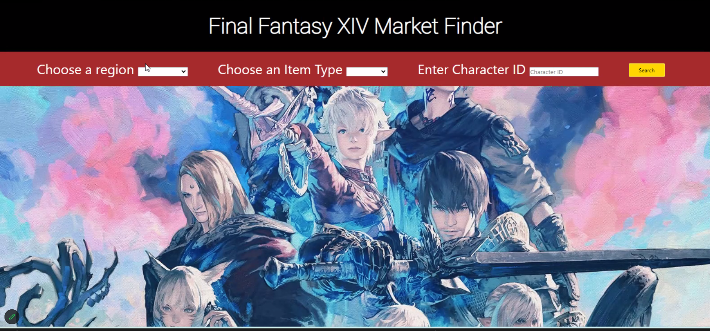
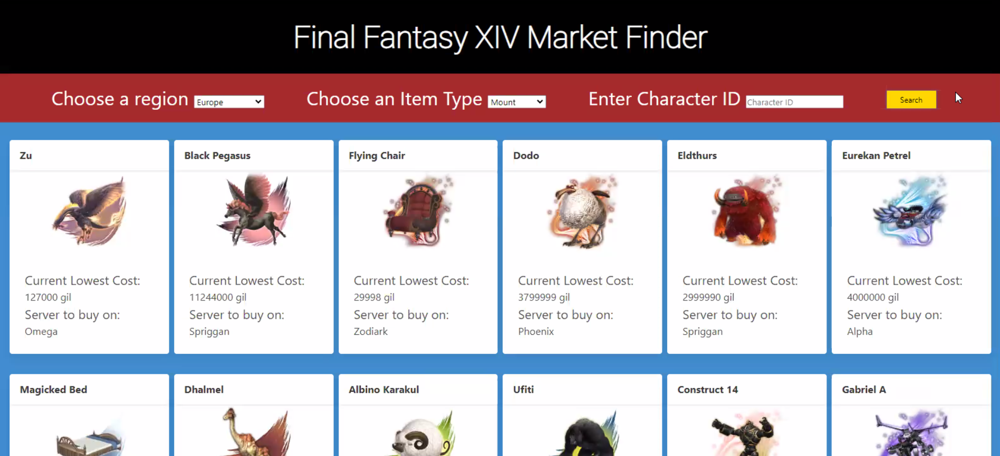

# FFXIV-Market-Finder
Allows the user to find the current cheapest postings for items in Final Fantasy 14, including allowing the user to get the data from their character to find items they don't own.

## GitHub Repo Link:

https://github.com/CountDuckoo/FFXIV-Market-Finder/tree/main

## Deployed Webpage Link:

https://countduckoo.github.io/FFXIV-Market-Finder/ 

## APIs Used:

Getting list of tradable items and their images from this API --
https://ffxivcollect.com/

Getting the lowest prices of those items and the server those prices are on -- 
https://docs.universalis.app/

## Mock-Up

### Landing Page:
Where you can search items by region and item type.  Character ID is optional.

### Results Page:
Will display the lowest priced available items. The name and a picture of the item, along with the current prize and where you can buy it.

